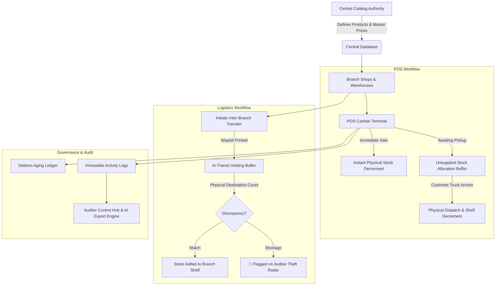

# 📦 Hysam Ventures — Multi-Branch POS, Inventory & Anti-Theft Control System

<div align="center">

[](https://laravel.com)
[](https://www.php.net)
[](https://www.mysql.com)
[](LICENSE)
[](verify_system_suite.php)

<p align="center">
  <strong>Enterprise Multi-Branch Point-of-Sale (POS), Real-Time Stock Segregation, Logistics Waybills, Debtors Ledger & AI Business Intelligence Hub.</strong>
</p>

</div>

---

## 🌟 Executive Summary

**Hysam Ventures** is an enterprise-grade wholesale and retail inventory operating system engineered in **Laravel** (PHP 8.3/8.4). Designed specifically for physical commerce, high-volume depots, and multi-branch operations, it delivers anti-fraud safeguards, immutable audit trails, and zero-loss logistics workflows.

### 🛡️ Why Hysam Ventures?
- **Anti-Theft Buffer Segregation:** Solves the classic *"Customer paid today, picking up goods tomorrow"* dilemma by segregating allocated physical shelf stock from available balance.
- **Waybill Transfer Verification:** Detects transit theft with verified physical destination counts before stock is added to shelf balances.
- **Central Authority Catalog:** Product creation, master pricing, and CSV bulk imports are restricted to Auditors/Admins, while branch attendants manage quantities (`Stock In`).
- **Zero-Decimal Market Currency:** Formatted cleanly for wholesale transactions (`₦75,000` instead of cluttered `.00` kobo).
- **AI Business Intelligence Engine:** One-click structured JSON and CSV exports optimized for Large Language Models (ChatGPT, Claude, Gemini, DeepSeek) to perform sales forecasting and margin analysis.

---

## 🏗️ Architecture & Anti-Theft Workflows



---

## 💎 Core Feature Modules

### 1. 💰 Point of Sale (POS) & Receipt Printing
- **Fast Touch & Barcode Tile Grid:** Real-time visual catalog with instant stock status badges (`In Stock`, `Low Stock`, `Out of Stock`).
- **Negotiated Price Support:** Cashiers can adjust unit selling prices on the fly for bulk market discounts.
- **Split Payment Modes:** Full Cash, POS Card, Direct Bank Transfer, or **Part-Payment / Debt** splits.
- **Dual Fulfillment Flags:** Toggle between *"Delivered Now"* vs. *"Awaiting Pickup"* to prevent inventory discrepancies.
- **Thermal & A4 Receipts:** Instant printable receipts with QR identifiers and balance due breakdowns.

### 2. 🛍️ Central Catalog & Bulk CSV Import
- **Role Authority Barrier:** Product creation, SKU assignment, and catalog editing restricted to `admin` / Auditor.
- **Multi-Criteria Filter Deck:** Search products by Stock Health pills (`🟢 In Stock`, `🟡 Low Stock ≤ 5`, `🔴 Out of Stock 0`), Category, and Price Range (₦).
- **CSV Bulk Import:** Download official template (`/products/template/csv`) and upload thousands of SKUs in seconds with auto-generated SKUs and initial branch physical stock allocations.
- **Multi-Format Exports:** Export catalog to Excel CSV, structured AI JSON, or Printable Price Lists.

### 3. 🚚 Waybill Logistics & Inter-Branch Transfers
- **Two-Step In-Transit Tracking:** Goods decremented from origin branch remain in an in-transit buffer and are not added to destination inventory until physically verified.
- **Printable Waybill Delivery Notes:** Official waybill documents with signature lines for Dispatch Officer, Carrier Driver, and Receiving Storekeeper.
- **Theft / Variance Radar:** Automatically flags missing units on the Auditor Control Hub whenever counted units differ from dispatched quantities.

### 4. 💳 Customer Debt Ledger & Part-Payment Recovery
- **Real-Time Debt Tracking:** Unpaid balances automatically update the customer's permanent ledger profile.
- **Debt Aging Buckets:** Classifies debtors into `CURRENT (0-7 Days)`, `DUE (8-30 Days)`, and `CRITICAL (30+ Days)`.
- **Installment Recording:** Pop-up payment modal calculates remaining balance in real-time and logs the collecting cashier.

### 5. 🤖 AI Data Export Hub & Reports Deck
- **Interactive Multi-Filter Reports:** Filter sales, stock valuation, transfer waybills, damaged goods, and debtor ledgers by Date Presets (`Today`, `This Week`, `This Month`, `This Year`, `Custom Date Range`), Branch, and Payment Status.
- **AI Prompt Ingestion Datasets:** Download clean, structured JSON datasets for direct feeding into ChatGPT, Claude, Gemini, or Python data pipelines.

### 6. 🔒 Session Guard Middleware & Visual Login Screen
- **Visual Sign-In Portal (`/login`):** Modern, dark-themed login screen with validation alerts and quick-fill credentials.
- **CheckWebAuth Middleware:** Intercepts unauthenticated route requests and redirects to `/login`.
- **One-Click Logout:** Topbar `🚪 Log Out` button terminates sessions and invalidates cookies immediately.

---

## 👥 Role Permissions & Anti-Fraud Security

| Role | Access Level | Permissions & Responsibilities | Security Safeguards |
| :--- | :--- | :--- | :--- |
| **Auditor / Super Admin** (`admin`) | **Central Authority** | Catalog creation, master price edits, staff accounts, CSV imports, system audits | Cannot modify immutable historical logs |
| **👑 Business Owner** (`viewer`) | **Executive View-Only** | Live view of revenue KPIs, multi-branch stock valuations, transactions, and debtors | **Zero write access** — cannot alter prices or delete records |
| **Branch Manager** (`manager`) | **Branch Operations** | POS sales, waybill transfer dispatches, customer debts, branch performance reports | Cannot create or delete master catalog items |
| **Sales & Stock** (`sales_stock`) | **Solo Attendant** | POS selling, customer debt recovery, stock additions (`Stock In`) | Cannot modify master catalog selling prices |
| **Storekeeper** (`storekeeper`) | **Logistics & Inventory** | Receiving supplier shipments, transfer count verifications, damaged goods write-offs | Cannot perform POS checkout or collect cash |
| **Cashier** (`cashier`) | **Checkout Terminal** | POS sales, collecting cash/POS payments, issuing receipts, debt installments | Cannot perform stock adjustments or waybill dispatches |

---

## 🚀 Quick Start & Local Setup

### Prerequisites
- **PHP 8.3 or 8.4** (`bcmath`, `ctype`, `fileinfo`, `json`, `mbstring`, `openssl`, `pdo_mysql`, `tokenizer`, `xml`)
- **Composer 2.x**
- **MySQL 8.0+** or MariaDB

### 1. Clone & Install Dependencies
```bash
git clone https://github.com/hotvictorious-rgb/hysam.git
cd hysam

composer install
```

### 2. Configure Environment
```bash
cp .env.example .env
php artisan key:generate
```

Edit `.env` to configure your database:
```dotenv
DB_CONNECTION=mysql
DB_HOST=127.0.0.1
DB_PORT=3306
DB_DATABASE=hysam
DB_USERNAME=root
DB_PASSWORD=

ADMIN_EMAIL=admin@hysam.com
ADMIN_PASSWORD=admin123
```

### 3. Run Migrations & Seeders
```bash
php artisan migrate --seed
```

### 4. Start Local Development Server
```bash
php artisan serve --host=127.0.0.1 --port=8000
```
Open **[http://127.0.0.1:8000](http://127.0.0.1:8000)** in your browser.

---

## 🧪 7-Tier Verification Suite

Hysam Ventures includes an automated verification script proving 100% mathematical accuracy across all business logic:

```bash
php verify_system_suite.php
```

### Verification Matrix:
- **Tier 1:** Immediate delivery sale formula & customer debt calculation ($100\%$ exact).
- **Tier 2:** Delayed pickup stock buffer segregation & subsequent physical dispatch ($100\%$ exact).
- **Tier 3:** Inter-branch transfer dispatch, in-transit buffer, and verification count ($100\%$ exact).
- **Tier 4:** Customer debt ledger calculations & partial repayments ($100\%$ exact).
- **Tier 5:** Sales returns & physical shelf restitution ($100\%$ exact).
- **Tier 6:** Full database relational integrity & zero-corruption scan ($0$ orphaned records).
- **Tier 7:** Full HTTP 200 verification across all 29 web endpoints, filter decks, and CSV/JSON export streams.

---

## 🌐 Production Deployment (Whogohost VPS & cPanel)

### Option A: Whogohost VPS / Cloud (Recommended)
```bash
# 1. SSH into VPS
ssh root@your-vps-ip

# 2. Clone repository & install dependencies
git clone https://github.com/hotvictorious-rgb/hysam.git /var/www/hysam
cd /var/www/hysam
composer install --no-dev --optimize-autoloader

# 3. Environment & Migrations
cp .env.example .env
php artisan key:generate
php artisan migrate --force --seed

# 4. Set directory permissions
chown -R www-data:www-data /var/www/hysam/storage /var/www/hysam/bootstrap/cache
chmod -R 775 /var/www/hysam/storage /var/www/hysam/bootstrap/cache

# 5. Cache configurations
php artisan config:cache
php artisan route:cache
php artisan view:cache
```

### Option B: Whogohost cPanel Shared Hosting
1. Compress project files (excluding `.git`, `node_modules`, `tests`) and upload to cPanel File Manager.
2. Extract into `/home/username/hysam/`.
3. Move files inside `public/` into `public_html/` and update `index.php` paths:
   ```php
   require __DIR__.'/../hysam/vendor/autoload.php';
   $app = require_once __DIR__.'/../hysam/bootstrap/app.php';
   ```
4. Create MySQL database in cPanel and update `.env`.
5. For complete step-by-step cPanel instructions, read [`docs/whogohost_cpanel_guide.md`](docs/whogohost_cpanel_guide.md).

---

## 📁 Repository Structure

```
hysam/
├── app/
│   ├── Http/
│   │   ├── Controllers/
│   │   │   ├── AuthController.php          # Sign in, Sign out, Session management
│   │   │   ├── Web/                        # POS, Stock, Auditor, Debt, Reports controllers
│   │   │   └── DataController.php          # State sync & API handlers
│   │   └── Middleware/
│   │       ├── CheckInstalled.php          # Installation wizard barrier
│   │       └── CheckWebAuth.php            # Web session guard middleware
│   ├── Models/                             # Product, StockLevel, Warehouse, Sale, Transfer, Customer...
│   └── Services/
│       ├── StockService.php                # Atomic transaction engine (Sales, Transfers, Debts)
│       └── BackupService.php               # Database snapshot generator & restore engine
├── database/
│   ├── migrations/                         # Database schema definitions
│   └── seeders/                            # Default seeds (Admin, Branches, Catalog)
├── docs/                                   # Business rules, cPanel deployment guide, AI rules
├── resources/views/                        # Interactive Blade UI views
│   ├── auth/login.blade.php                # Visual sign-in screen
│   ├── pos/                                # POS checkout, receipts, returns
│   ├── products/                           # Catalog management, filters, CSV import
│   ├── stock/                              # Stock levels, transfers, adjustments, unsupplied
│   ├── debts/                              # Debtors ledger & payment recoveries
│   ├── auditor/                            # Auditor anti-theft & control hub
│   ├── reports/                            # Multi-filter reports & AI export hub
│   └── help/index.blade.php                # In-app role training guides & FAQs
├── verify_system_suite.php                 # 7-Tier automated mathematical audit test runner
├── CHANGELOG.md                            # Comprehensive release history & audit trail
└── README.md                               # System documentation & deployment guide
```

---

## 📄 License & Governance

This software is licensed under the **MIT License**.  
All ongoing development follows the engineering and documentation standards defined in [`docs/ai_agent_rules.md`](docs/ai_agent_rules.md).
